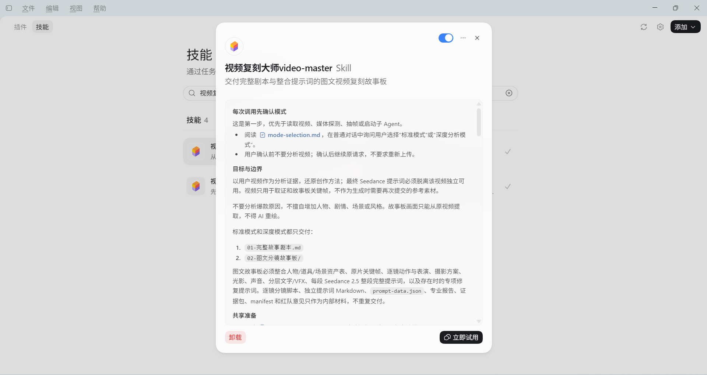
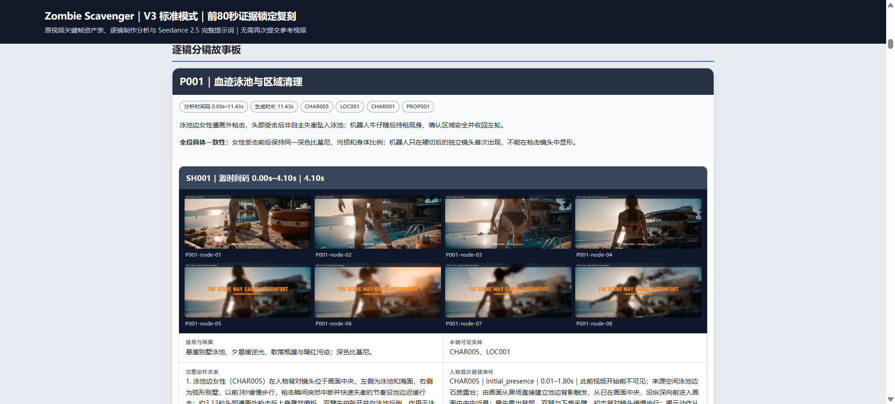
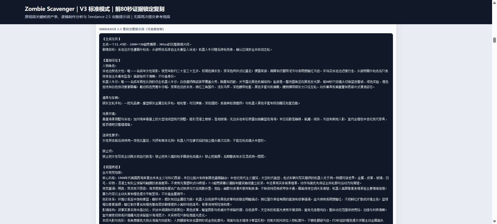
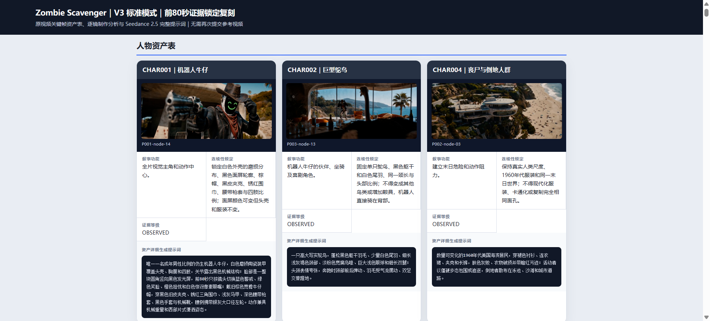
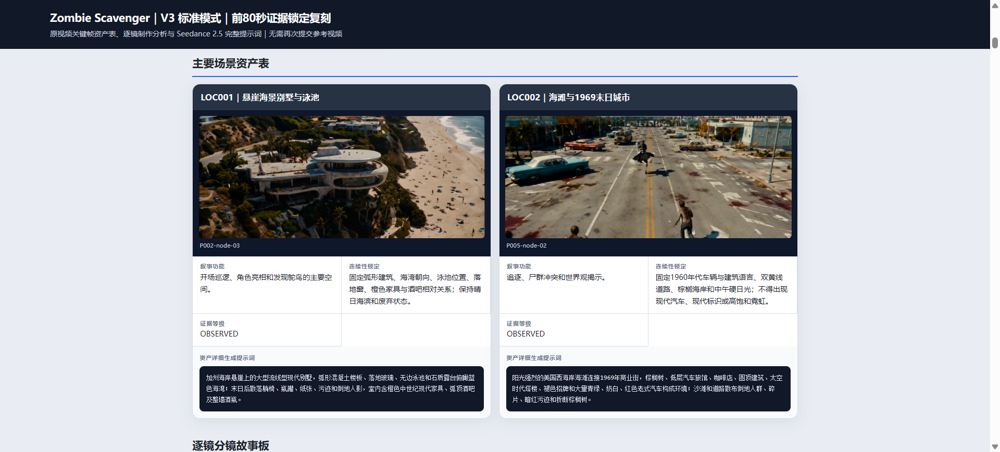
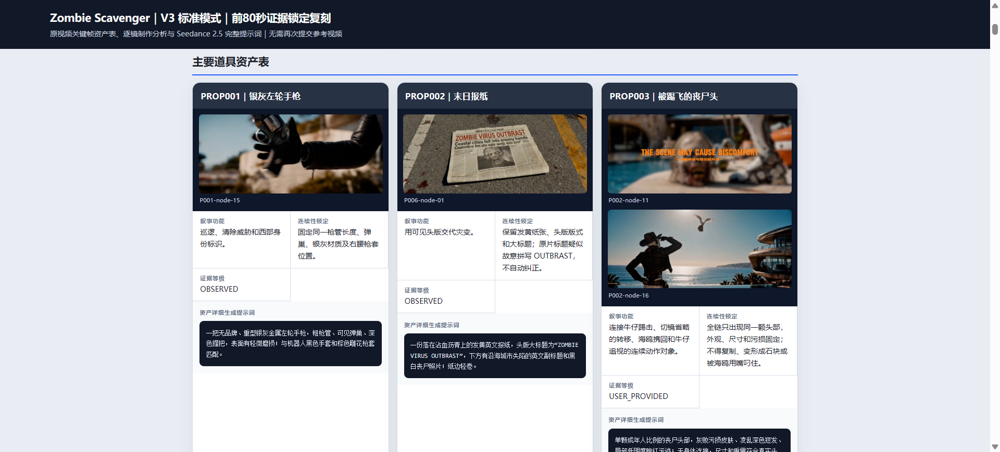
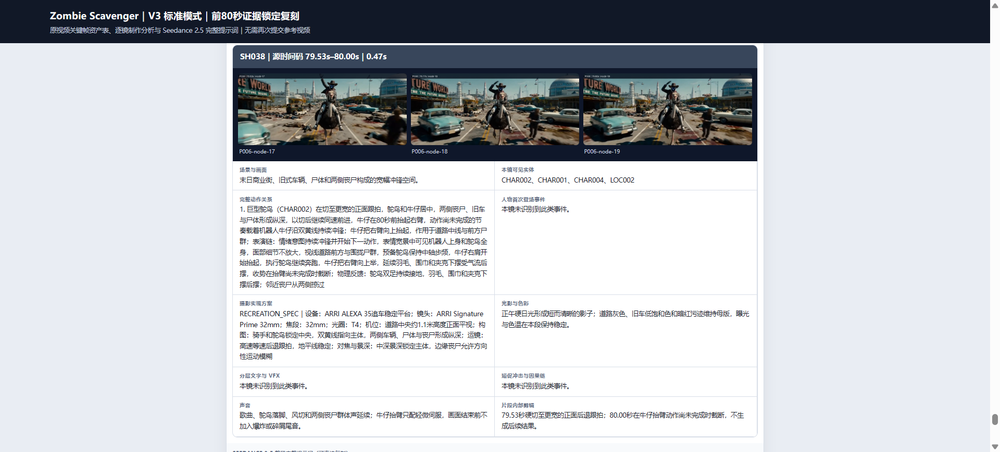

# 视频复刻大师video-master

**把参考视频拆解成完整剧本、图文分镜故事板，以及可直接复制的 Seedance 2.5 剧情提示词。**

`video-master` 是面向 Codex 的视频复刻 Skill。你提供一段视频，选择分析模式，它会按真实镜头拉片，梳理故事发展、人物表演、摄影、美术、声音与特效，再把这些信息整理成可用于后续 AI 视频制作的复刻制作包。

它的目标是让你看懂一段视频具体如何呈现，并获得分段重建它所需的画面描述、时间轴和连续性约束。

[快速开始](#快速开始) · [交付内容](#交付内容) · [功能与作用](#功能与作用) · [模式选择](#模式选择) · [截图展示](#截图展示)



## 功能与作用

| 功能 | 具体做什么 | 对复刻有什么帮助 |
| --- | --- | --- |
| 真实镜头拉片 | 识别镜头边界、时间码、时长、动作与转场，复核自动切镜候选 | 区分真实切镜与遮挡、变形、播放器痕迹，保留原片节奏 |
| 按剧情动态分段 | 先识别真实镜头，再按完整故事动作组织剧情片段，不固定按 5 秒切分 | 每条提示词描述一段完整剧情，减少动作被不合理截断 |
| 人物、道具、场景资产表 | 提取原片代表帧，整理外观、材质、空间关系、叙事功能与连续性描述 | 为不同片段提供一致的人物与视觉设定 |
| 动作与表演分析 | 记录视线、表情、动作预备、执行、延续与收势，跟踪人物首次登场 | 把“做了什么”细化为可见的表演过程 |
| 跨镜动作连续性 | 追踪小物体、接触点、抓取、抛接、携带和状态变化 | 减少物体突然消失、动作因果缺失或持有者变化 |
| 摄影、美术与声音设计 | 分析景别、构图、运镜、光影、色彩、服装、对白、拟音与音乐关系 | 让复刻同时覆盖剧情、画面和声音 |
| 原片关键帧故事板 | 从输入视频提取代表帧，复杂动作增加关键状态帧 | 图文对照理解镜头，故事板画面来自原片 |
| Seedance 2.5 整段提示词 | 按剧情片段编写完整、自包含的生成描述，嵌入故事板 | 复制对应片段的提示词即可开始新的生成任务 |
| 一致性与时间轴校验 | 检查时长覆盖、镜头与事实对应、字段完整度、图片引用和提示词结构 | 提前发现遗漏、重复、串镜和数据冲突 |

适用于短片、广告、视觉动作演示、AI 视频创作练习和复杂场景的制作方法分析。重点是视频内容与创作方法的复刻，不分析爆款原因或传播数据。

## 交付内容

最终向用户交付两项成果：

```text
交付目录/
├── 01-完整故事剧本.md
└── 02-图文分镜故事板/
    ├── 图文故事板 HTML
    ├── 原视频关键帧图片
    └── 总览图 / PDF（根据渲染环境与任务配置生成）
```

### 1. 完整故事剧本

覆盖故事框架、人物设定、剧情发展、可确认的对白及声音信息。对于没有传统故事结构的视频，输出完整视觉动作剧本，按原片实际内容描述。

### 2. 图文分镜故事板

在一份可浏览的故事板中整合：

- **首页资产表**：人物、主要道具、主要场景的原片代表帧、详细生成提示词、叙事功能与连续性约束。
- **逐镜分析**：源时间码、持续时长、原片关键帧、完整动作关系、表演与首次登场、摄影方案、光影、声音及分层文字 / VFX。
- **逐段完整提示词**：每个剧情片段末尾提供一条覆盖整段的 Seedance 2.5 提示词。
- **专项修复提示词**：存在明确修复需求时，集中放在故事板末尾。

逐镜分析与提示词直接整合在故事板内；专业报告、证据包和结构化 JSON 用作内部工作材料。



## 提示词怎样帮助分段复刻

每个剧情片段的主提示词采用同一结构：

```text
【生成任务】
时长、画幅、帧率、视频类型与本段剧情目标。

【基础设定】
本段人物、道具、场景、连续性要求与禁止项。

【氛围质感】
全片视觉风格、视觉基调、色彩与影调结构；
本段光影变化及声音设计。

【时间轴】
相对时间 → 场景与动作 → 对象状态变化与反馈 → 本镜摄影方案。
```

提示词完整写出所需的人物、服装、道具、场景与画面状态，不依赖“参考视频”“与上一段相同”或素材编号。跨片段重复必要的稳定设定，并明确各段中实际发生的变化，帮助维持拼接时的人物、环境、光影与动作连续性。

摄影设备、镜头、焦段与光圈属于 **复刻建议方案（RECREATION_SPEC）**，用于描述如何实现相似画面，不冒充原片拍摄元数据。



## 模式选择

每次调用后，Skill 会在普通对话中询问模式，等待你确认后开始分析。

| 对比项 | 标准模式 | 深度分析模式 |
| --- | --- | --- |
| 适合内容 | 大多数短视频、较少人物与场景 | 多人物、多场景、复杂叙事、复杂 VFX 或高连续性项目 |
| 分析分工 | 通常 1–2 个子 Agent；复杂动作或冲突可触发额外定向复核 | 导演、编剧、摄影、美术、提示词五个核心专业角色，加轻量审查；剪辑 / VFX 和声音按需启动，通常 6–8 个子 Agent 分波次执行 |
| 最终交付 | 完整故事剧本 + 图文分镜故事板 | 相同两项交付 |
| 提示词要求 | 完整、自包含，使用统一格式与字段校验 | 使用相同格式与字段校验，增加专业拆分和独立复核 |
| 主要差别 | 分工集中，适合日常分析 | 资产、摄影、动作和剧情边界有更多专业交叉复核 |
| Token 规划参考 | 常规双子 Agent 工作流记为 100% | 通常约 150%–220%；额外专业角色均触发时可能约 180%–250% |

Token 比例是 Skill 工作流中的预算估计，并非实测基准或费用承诺。实际消耗取决于视频长度、镜头数量、动作复杂度、模型及补充取证次数。

## 截图展示

以下图片来自已提供的 PNG 演示素材，展示已有项目的输出样式。截图保留当时的 V3 标题；当前技能名为 `video-master`。仓库没有包含演示视频。

### 人物资产表

通过代表帧与文字定义人物外观、服装、身份特征和跨片段连续性。



<details>
<summary>查看场景资产表</summary>

场景描述覆盖空间结构、时代、陈设、天气、光向和色彩，帮助不同生成片段保持同一视觉世界。



</details>

<details>
<summary>查看道具资产表</summary>

记录道具形态、材质、文字、叙事功能和交互状态，支持跨镜头对象追踪。



</details>

<details>
<summary>查看逐镜动作、摄影、光影与声音分析</summary>

每个镜头的关键帧与制作说明放在一起，便于核对动作、画面和声音设计。



</details>

## 快速开始

### 安装 Skill

将本仓库作为 `video-master` 文件夹放入 Codex 的个人技能目录。默认目录为 `~/.codex/skills/`；如果配置了 `CODEX_HOME`，使用该目录下的 `skills/`。请确认目标文件夹不存在，再执行克隆。

Windows PowerShell：

```powershell
git clone https://github.com/ai-creative-coder/video-master.git "$env:USERPROFILE\.codex\skills\video-master"
```

macOS / Linux：

```bash
git clone https://github.com/ai-creative-coder/video-master.git ~/.codex/skills/video-master
```

也可以通过 GitHub 的 **Code → Download ZIP** 下载，将解压后的文件夹命名为 `video-master`，放入技能目录。确认文件路径为 `video-master/SKILL.md`。

### 准备运行环境

- 能执行本地命令、查看视频关键帧并调用子 Agent 的 Codex 环境。
- Python 3.11 或更新版本。
- FFmpeg 与 FFprobe，可从命令行调用，用于媒体探测和抽帧。
- Pillow，用于关键帧标注和故事板图片排版。
- 导出 PDF 时需要脚本能找到 Edge、Chrome 或 Chromium；当前脚本内置 Windows Edge 常见路径，也会检查 `PATH` 中的 `msedge`、`chrome`、`chromium`。

在已克隆的仓库目录中安装 Python 依赖：

```bash
python -m pip install -r requirements.txt
```

### 开始分析

在 Codex 中调用技能，并上传视频或提供可读取的本地视频路径：

```text
$video-master 帮我分析这个视频：<你的视频完整路径>
```

随后在对话中回复 `标准模式` 或 `深度分析模式`。完成后打开图文故事板，对照关键帧检查剧情，并复制相应剧情片段的整段提示词开展生成。

本 Skill 交付的是复刻制作包，实际生成视频和拼接由后续制作步骤完成。各平台支持的时长、输入长度和生成控制项需以你使用的平台为准；提示词中的剧情时长不代表平台一定支持该时长。实际画面还原和段间衔接需要通过生成结果检查与迭代确认。

## 仓库结构

```text
video-master/
├── SKILL.md                 # 技能入口与工作流约束
├── agents/openai.yaml       # 技能显示名与默认调用提示
├── references/              # 模式、角色、数据结构与故事板规则
├── scripts/                 # 视频探测、数据构建、抽帧、渲染与校验
├── assets/                  # 剧本、故事板模板与结构化数据 schema
├── tests/                   # 时间轴与提示词回归测试
├── docs/images/             # PNG 功能展示截图
└── requirements.txt
```

## 开发验证

```bash
python -X utf8 tests/test_timeline_prompt.py
```

脚本负责处理结构化分析数据、媒体文件与模板。视频理解、专业分析和提示词内容由 Skill 协调 Codex 完成，单独运行抽帧脚本不会自动生成完整分析。
